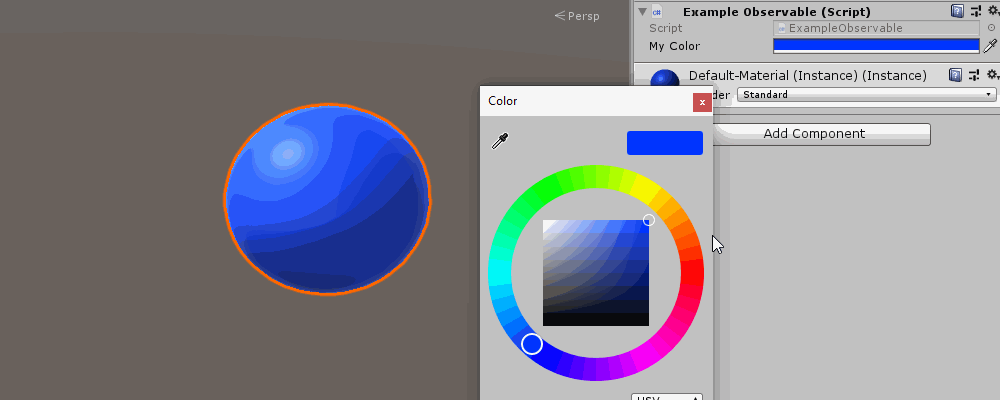

# UnityObservables

A tiny package containing generic implementations for Observables that play nice with the Unity Editor. The Observables are serializable, they display nicely in the inspector, and they work with the UNDO system.

> ⚠️ Note: This library evolved into [**Spoke**](https://github.com/Adam4lexander/Spoke), a mini-framework in two files.<br>
> Spoke includes `UState<T>`, which is equivalent to `Observable<T>` from this repo, but more robust and resolves several long-standing issues.<br>
> It also provides a toolbox of reactive primitives to simplify eventful logic. These are fully optional — if all you need is an observable variable that works in the editor, `UState<T>` does exactly that.<br>
> If you're starting fresh, Spoke is recommended over UnityObservables.

## Background

The Observable pattern is extremely useful in Unity for many reasons. Not least of all is the potential performance gains. Without Observables you may need to check if a value has changed each frame inside an
Update function. Since Unity uses reflection to call Update this can really add up, something I was surprised to see when profiling an oculus quest game. It was truly death by a thousand cuts.

I scoured the internet for an Observable implementation for Unity. There are quite a few good ones on various blogs and forums, but they weren't entirely seamless how they integrated with Unity. So learning
from those examples and extending them further I've come up with this package. Hopefully a rock-solid implementation of Observables that work great in Unity.

## Getting Started

Clone this repo or download its ZIP-file and copy the UnityObservables folder into your project.

## Example



```csharp
using UnityEngine;

// Need to bring in the UnityObservables namespace
using UnityObservables;


public class ExampleObservable : MonoBehaviour {

    // Unity doesnt serialize generic types, so we must make concrete types for any observables
    // we want to use. Remember to give it the Serializable attribute.
    [System.Serializable]
    public class ObservableColor : Observable<Color> { }


    // Create the observable color field. It's possible to set the default color to red.
    public ObservableColor MyColor = new ObservableColor() { Value = Color.red };


    void Awake() {
        // Subscribe to the Observers OnChanged event. There is also a 'OnChangedValues' event which
        // passes the previous and next values
        MyColor.OnChanged += ColorChangedHandler;
    }


    void ColorChangedHandler() {
        // The Observables current value is accessible through its 'Value' property. You can set a new
        // value with it too.
        GetComponent<Renderer>().material.color = MyColor.Value;
    }


    void OnValidate() {
        // Required to make the Observable fire events due to UNDO operations in Unity. If you're not
        // fussed about this then its not needed.
        MyColor.OnValidate();
    }
}
```
